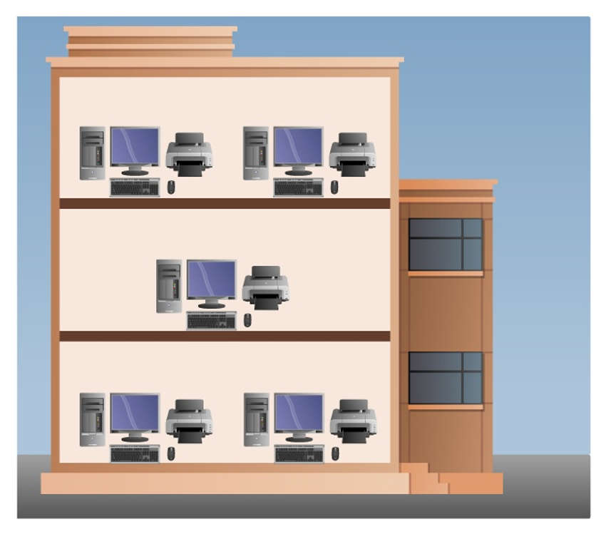
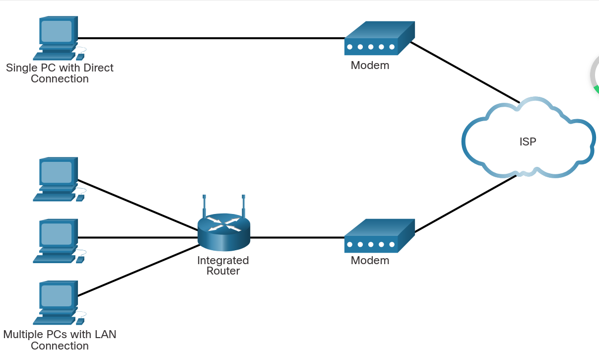
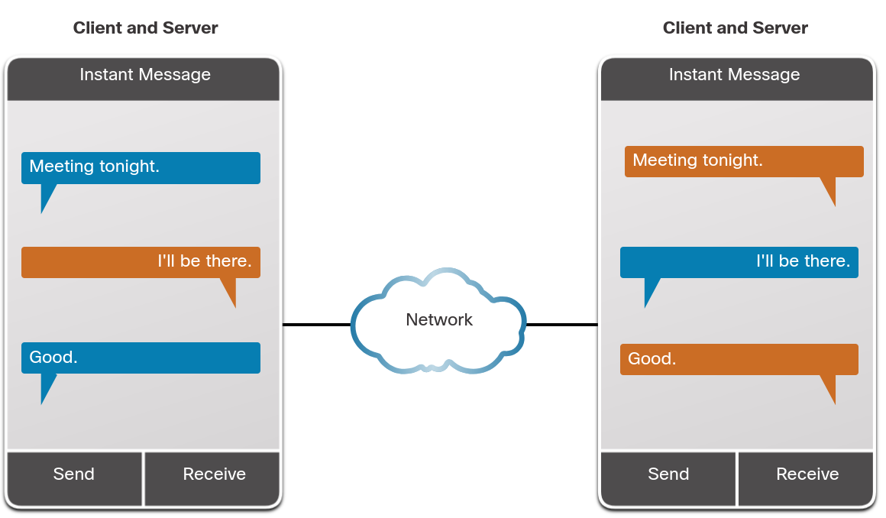

# Tipos de Rede
Uma rede **LAN** é um rede **local** já uma rede **WAN** é uma rede **ampla**, como a Internet

Uma rede se trata de um estrutura de dispositivos conectados, onde cada dispositivo é um nó

Redes locais podem ser simples como somente dois computadores ou mais complexas possuindo centenas de dispositivos conectados ao mesmo tempo

Um exemplo que podemos ter de redes locais são redes corporativas (**intranet**), onde muitas pessoas estão conectadas ao mesmo tempo. Tais redes são denominadas de **SOHO (small office/home office networks)**

SOHO nos permite ter conectividade com internet, impressoras, clientes, dentre outros

Business e SOHO geralmente provêm uma rede compartilhada de conexão à internet

+ Small Home Network (SHM)
	+ Realiza a conexão de poucos computadores e dispositivos à internet
	 
+ SOHO
	+ São redes onde o usuário, de forma remota ou não, pode acessar a rede corporativa e/ou seus recursos compartilhados de forma centralizada
	 
+ Medium Large Networks (MLN)
	+ Comuns em escolas e empresas, são redes que podem ter muitas localizações e centenas ou milhares de dispositivos (hosts) interconectados simultaneamente
	
+ World Wide Web (WWW)
	+ Se trata da rede de redes que permite a conexão entre dispositivos em todo o mundo
	+ **A internet (interconnected networks) se trata de uma rede de redes** pois é um conjunto de redes conectadas entre si por meio de protocolos
	
# Infraestrutura da Rede

## End devices
Podem também ser denominados de Hosts

São conectados entre si por links de comunicação (communication links) e packet switches

São os aparelhos que temos mais familiaridade (PCs, impressoras, celulares, cameras de segurança)

Para realizar a **identificação** dos Hosts endereços são usados (**IP e MAC**)

**Quando uma comunicação se inicia, o Host usa o endereço do destino para especificar aonde deve chegar o request**

**Ao longo do processo de transmissão de dados, mais de um roteador pode compor o caminho realizado, usando de encaminhamentos até chegar ao destino**
## Firewall
Realiza a **proteção dos membros de uma dada rede** controlando que pode ter acesso interno e o que os dispositivos conectados na rede podem acessar

**Controla entrada e saída de conexões**
## Switch
Se trata de um aparelho que **permite a conexão de múltiplos aparelhos dentro de uma mesma rede**

Com switch podemos enviar dados entre dispositivos de modo direcionado à porta em que o endpoint está conectado

Tipicamente usados em Access Networks

**Como eles estão na mesma rede é utilizado o MAC e não IP**
## Router
Se trata de um aparelho que **permite o tráfego via Internet**

Tipicamente usados no network core

No geral, um modem possui o Router e o Switch
# Transmissão de Dados
O **tráfego de dados em redes não ocorre com um único pacote (packet)**, mas sim em pacotes fragmentados que, quando reestruturados, geram o dado original

A transmissão de informação se dá por meio da conversão de Bytes para sinais elétricos, por exemplo, que chegam ao switch e são replicados até seu destino final

1. O dispositivo que está enviando dados segmenta o packet e adiciona headers a cada segmento
2. Tais packets são enviados via rede até o destinatário
3. Ao chegar ao destinátario ocorre a montagem desses packets restaurando sua estrutura original

**A transmissão ocorre via redirecionamentos entre dispositivos** que compõe a infraestrutura de rede. **Tais redirecionamentos são conhecidos como routes ou paths**
## Tipos de Produção de Dados
Todos esses tipos de dados são armazenados remotamente pelo provedor em sua Cloud e o que eles fazem com essa informação deve seguir padrões de leis para seu uso
### Volunteer
São dados que o **usuário é responsável por sua produção**

Se enquadram aqui, por exemplo, posts em uma rede social e aceitar fomulários de aplicativos
### Observed
São **dados que monitoram nossas ações**

Se enquadram aqui dados que são, por exemplo, rastreio de nossa localização via aplicativos
### Inferred
São dados mais silenciosos em sua produção, são a **junção dos tipos de produção de dados Observed e Volunteer**

**São gerados por nossa atividade rotineira**, como transações financeiras onde são coletadas informações a respeito de lugares frequentados, produtos consumidos e informação a respeito da localização no momento da produção do dado
## Bits e Bytes
Os dados são armazenados e transmitidos em formato de Bits (Binary Digit) que podem ter valores 0 ou 1

Bit é a **menor unidade do dado que podem ser armazenadas ou transmitidas** de uma entre duas formas distintas de estados discretos (discrete states), como por exemplo de estados discretos temos:
+ duas formas de magnetização
+ duas formas de voltagem (127 V e 227 V)
+ dois níveis distintos de intensidade de luz (on e off)
+ qualquer outro tipo de sistema físico que opere em dois estados discretos possíveis

**Computadores usam códigos binários para tratar letras, números e caracteres especiais**. Esses códigos são, por exemplo, **ASCII** (American Standard Code for Information Interchange) e **Unicode**

**Um conjunto de 8 bits é denominado de Byte**
## Inputs
**Qualquer interação de um hardware com um dispositivo gera dados binários que serão interpretados, processados e armazenados pelo CPU** (Core Processing Unit), como por exemplo, cliques em um mouse
## Outputs
Se tratam do **resultado que o dispositivo** (computador, impressora) traduz de Bits para uma forma legível para humanos
## Métodos Comuns de Transmissão de Dados
Após a conversão de uma forma legível para humanos para bytes, esses bytes devem ser convertidos em sinais para serem transmitidos ao longo da rede física (exemplo fibra óptica) para chegarem a seu destino

**Um sinal consiste de um pulso elétrico ou padrões ópticos que são transmitidos entre dispositivos conectados**

Sinais podem sofrer mais de uma conversão ao longo da sua transmissão até chegar ao destino. Os tipos mais comuns de sinais são:
+ Elétricos
	+ Sua transmissão é efetuada por meio de pulsos elétricos em um fio, idealmente de cobre
+ Ópticos
	+ Esse modo depende de uma conversão prévia do pulso elétrico para o óptico
+ Wireless
	+ Aqui a transmissão é feita via radiação (IR, microondas, ondas de rádio)

## Internet Service Provider (ISP)
Permitem o acesso de um rede local com a internet

Pode ser um provedor local via cabos ou até mesmo um provedor independente que disponibiliza Bandwidth via infraestrutura de rede física de outra companhia

**Cada ISP se conecta a outros ISPs de modo a formar uma rede que interconecta de forma hierárquica os usuários ao redor do mundo garantindo que a transmissão de dados faça o menor caminho possível até seu host de destino**

São um conjunto de packet-switches e communication links que permitem redirecionar o tráfego ate o destino final sendo essa infraestrutura fornecida pela operadora
## Conexões ISP
São feitas de modo hierárquico para garantir que o destino do request seja alcançado com êxito seguindo o menor caminho possível

Uma conexão direta de um Modem com o ISP, apesar de poder ocorrer, não é recomendada em termos de segurança, uma vez que ficamos mais expostos

O modo mais seguro consiste no uso de um Integrated Router (IR) junto de um Modem. O IR possui um Switch, permitindo a conexão de diversos usuários

# Banda Larga (Bandwidth)
É a **capacidade** de um meio transportar dados, **em cenários ideais**, em termos de taxas de bits por segundo (MB/s = Mbps)
# Throughput
Assim como Bandwidth, o Throughput lida também com taxas de transferência de dados por unidade de tempo mas **"de forma realista"**

O Throughput não necessariamente é igual ao Bandwidth devido a uma série de fatores como por exemplo:
+ A **quantidade de dados** sendo transmitidos pela conexão
+ Os **tipos de dados** sendo transmitidos
+ **A latência gerada pelo número de dispositivos que os dados devem percorrer para chegar ao seu destino**

O Throughput **não leva em conta a validade ou usabilidade dos bits** transmitidos e recebidos

**Numa operação de rede, o Throughput não pode ser mais rápido que a conexão do caminho de origem até o destino**

O Throughput é sensível, **basta um ponto de gargalo onde o Bandwidth/Throughput seja baixo entre o caminho da fonte para o destino para que ele gere gargalos** e seja mais lento que o esperado
# Latência
É o tempo de tráfego (incluindo eventuais delays) que leva para levar o dado ao seu destino
# Download e Upload
Download é a taxa com que os dados estão sendo recebidos

Upload é a taxa com que os dados estão sendo enviados
# Dispositivos
## RFID (Radio Frequency Identifier)
Podemos usar RFID para monitorar ou rastrear dispositivos que estão atrelados a ele
## Actuators
São dispositivos que permitem a produção de movimento físico
# Clients e Servers
**Todo dispositivo conectado a uma rede e que participa do processo de comunicação via rede é classificado como host**

Um host pode atuar tanto como um Cliente e/ou um Server

**O papel a ser desempenhado pelo host depende do software instalado nele**

Um **Client** são hosts tem como função **obter informações de um host** que atua como Server via requests

Um **Server** são hosts que tem como função **prover informação a outros hosts** na rede. **Cada funcionalidade de servidor tem seu próprio software (email, web, files, ...)**

# Peer-to-Peer Network (P2P)
**São redes onde o host atua, simultâneamente, como Client e Server**

Para que um host atue como P2P é necessário que ele possua softwares que o permitam atuar como Server e Client ao mesmo tempo

A sua principal desvantagem é que os **hosts podem ter seu desempenho reduzido** devido ao seus dois papéis que estão sendo executados ao mesmo tempo

Podemos ter uma rede com mais de dois computadores que executam P2P, mas para isso é necessário, por exemplo, um Switch

**Vantagens do P2P:**
+ Simples de implementar
+ Menos complexo
+ Pode ser usada para tarefas simples, como transferência de arquivos e compartilhamento de impressoras
+ Menor custo, uma vez que dispositivos de rede e servers dedicados podem não ser necessários
**Desvantagens do P2P:**
+ Administração descentralizada
+ Não muito segura
+ Não é escalável
+ Todos dispositivos poderão atuar como Server e Client o que pode reduzir a performance dos mesmos
# P2P Híbrido
**Nesse modelo os hosts atuam como Server e Client ao mesmo tempo mas os index de localização de recursos estão armazenados em um repositório centralizado**

O funcionamento se baseia em que cada acesso de cada Peer é realizado acessando a localização do outro Peer no repositório centralizado para dar sequência na operação

# Conexões via Cabos e DSL
Conexões vi cabos são realizadas via um cabo coaxial que permite uma conexão com alta Bandwidth, sempre ligada

**No modelo via cabos**, um **modem separa o sinal de internet de outros sinais** que também são transmitidos no mesmo cabo

**Conexões via DSL** (Digital Subscriber Line) também proveem uma alta Bandwith e sempre ligada, mas oferece como diferencial um modem de alta velocidade que **separa o sinal do DSL dos demais sinais**

Os sinais de DSL são transmitidos numa linha telefônica que é dividida em três canais com seus propósitos sendo:
+ Recebimento de chamadas sem perda de conexão
+ Downloads 
+ Upload

No geral, Upload é mais lento que Download
# Redes Wireless
## Wi-Fi
É uma conexão de rede que permite a dispositivos se conectarem a um roteador

Demanda de menos bateria de dispositivos se comparado ao 5G

Podemos conectar dispositos a outros dispositivos usando Wi-Fi
### Medidas de segurança
+ Evitar envio de informações sensíveis sem criptografia
+ Uso de VPN para envio de informações sensíveis
+ Ativar segurança em redes residenciais
+ Uso de WPA2 ou uma criptografia de mais alto nivel para segurança
## Bluetooth
É uma rede de curta distância que permite a comunicação de dispositivos para envio de dados e áudios

2.4 GHz

Múltiplos dispositivos podem estar conectados ao mesmo tempo
## NFC (Near Field Communication)
Usada para conexão de serviços de pagamentos e um smart phone

Para realizar a conexão e transmissão de dados ela faz uso de campos magnéticos 
# Mobile
Dispositivos Mobile, como smart phones e tablets, fazem uso de frequências de radiação para performar suas conexões

Cada funcionalidade de conexão possui sua específica frequência, como por exemplo, ligações, 4G, 5G, Bluetooth, GPS, NFC, dentre outros
# Endereços
## IP (Internet Protocol)
É um endereço único dentro de uma rede que pode ou não ser privado que pode mudar

Permite a comunicação entre dispositivos em dispositivos em redes diferentes

Até o destino final alguns redirecionamentos podem ocorrer
## IPv4
Composto de 32 bits (4 Bytes)
## IPv6
## MAC
Se trata de um endereço aleatório e estático dentro do hardware, como um **número de série** e só funciona **localmente**
## DNS (Domain Name System)
**É como a internet interpreta o endereço de um site**, o transformando num IP específico e permitindo o acesso a ele de modo eficaz
## CIDR
Padrão de IPs que, por exemplo, uma rede pode assumir e usar
# Protocolos
## TCP (Transfer Control Protocol)
É um protocolo de dados que **garante a integridade de tráfego de dados via um handshake** entre o server e o client

Por conta de ser confiável é uma forma **mais lenta**
## UDP
Um método de envio de dados que **não garante a integridade dos dados**

É um método **mais ágil**
# Interface de Rede
**Permite ao dispositivo se conectar com outros para enviar e receber dados, traçar rotas para chegar a um dado endereço**

Cada interface de rede possui um IP e um MAC específico

Podemos ter diferentes tipos de interface de rede:
+ Física (hardware)
	+ Placa de rede Ethernet (eth0), portas USB
+ Virtual (software)
	+ VPNs, containers, pods, loopback (uma interface interna do PC, muito útil para testes)
+ Meios físicos de transmissão
	+ RJ-45 e Wi-Fi (wlan0)
# Portas
Funciona de modo a **selecionar qual aplicação num dado IP receberá o request**

Temos uma **porta de saída do cliente que pode variar** e uma **porta de entrada do server/aplicação que será o destino**

A porta do cliente e do server/aplicação pode ser diferente mas **o destino do request feito pelo client deve ser endereçado na porta correta**

[ Internet / Outro Pod ]
        ↓
     (IP + Porta)
        ↓
Node → veth externo
        ↓
Pod → eth0 → porta da aplicação
## Ethernet
Comumente denominada de **LAN** é a porta que trata da conexão local de rede

Ao conectarmos uma cabo RJ-45 ao roteador ele estará diretamente **interagindo com o Switch**

Dispositivos conectados de modo wireless se conectam via Ethernet (LAN) por padrão

Podemos pensar em LAN como sendo o output da conectividade de rede
## Internet
São portas usadas para **realizar a conexão com uma rede que não a LAN** e comumente denominadas de **WAN**

Geralmente usada para ligar um cabo coaxial ou DSL, gerando acesso à internet

Podemos pensar como WAN sendo o input da conectividade de rede proveniente do ISP

Roteadores que já contém um modem interno não possuem a porta WAN exposta no dispositivo
## Ethernet vs Internet
|**Conceito**|**Analogia Proposta**|**Função Principal**|**Ponto de Acesso Comum**|
|---|---|---|---|
|**WAN**|**Input da Conectividade**|Traz a rede (Internet) de **fora** para dentro.|Modem (conectado ao ISP)|
|**LAN**|**Output da Conectividade**|Distribui e permite o **uso interno** da rede.|Roteador (conectado aos dispositivos)|
